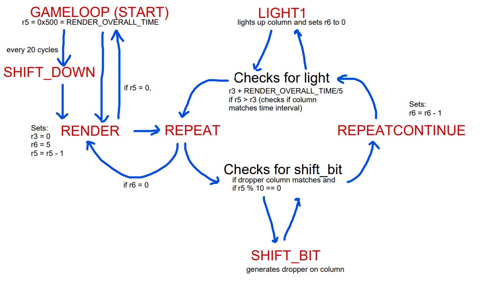

# Introduction:

Since the 80s, Tetris has captivated audiences across the globe, with most game consoles featuring at least one iteration of the beloved block-moving game. With recent renditions of Tetris expanding on new gamemodes, attractive visuals and even multiplayer options, I've always wanted to explore the opposite, and simplify the game to its most fundamental elements. Hence, using the microbit, I have set out to create a light show featuring the most rudimentary form of Tetris.

# Broad Overview:

Under the hardware limitations, I recreated 4 main features of the original Tetris:

1) A block or "dropper" that slides vertically downwards from the top.
2) Stackable blocks which descend until they reach the bottom of the screen or collide with another block.
3) Controls to allow the player to move the block from the left to right.
4) Rows which disappear once a row of blocks is filled.

# Implementation:

### Constants:

Constants are unchanging values to allow the program to be more modifiable.

RENDER_OVERALL_TIME - stores the start of the render clock, the total time each frame is displayed. The render clock is reset to this constant at the end of each cycle. 

SHIFT_CYCLE - stores the start of the shift clock, the number of frames rendered before the game progresses to the next state. This allows users to control how fast or slow they want the game to be.

DROPPER_BRIGHTNESS - stores the number of decrements of the render clock before a dropper is generated. 

### Data structures:

These values change often throughout the execution of the program.

image - Each column to be displayed is stored one after another in this data structure after their index. Keep in mind that the dropper is not written directly into this data structure (unless a collision is detected and a new dropper is generated).

shiftclock - This serves as a global timer. I chose to store it as a memory address rather than in a register to prevent the data from being clobbered by code. 

dropper - The column and row in which the dropper should be generated on.

store_flag - Indicates that a block has been stored and a new dropper should be generated.

### Initialization

Here are the actions performed whenever the program is started:

1) The RNG is started. 
2) Sets the GPIOTE configurations 
5) Initializes LEDS

### shift_bit function:

shift_bit is called when the column to be displayed matches the one stored in the dropper data structure. Its primary purpose is generating a column to be displayed: using an orr on the image column with a bit mask and returning the result. However, it also stores the result within the .image data structure if the dropper will collide with another block in the next frame. I've packaged these two functionalities into the same function as it means the generating of the column, and storing can be handled at once without having to constantly access the column from the image data.

### row_remove function:

row_remove checks to see if the last row of the image data structure will be removed. To do this, it performs and "and" function on every column within the image. If the result has a 1 in the least significant bit, every column is shifted downwards and stored back into the image. Since this does not need to be run on the completion of every frame, as rows may only be removed if a dropper has collided, it is only called if the store_flag is set.

### shift_down function:

shift_down is called at the end of each shift cycle, reducing the row of the dropper by 1 and resetting the shift clock back to the value @SHIFT_CYCLE. It also checks the store_flag which is altered by the shift_bit function. If true, the shift_down resets the dropper to its original position at the top of the led display and unchecks the store_flag. 

### GPIOTE_IRQHandler

This is the interrupt handler which increments or decrements a dropper's current column based on whether the left or right button is pressed.

### main gameloop

The gameloop starts by initializing the render clock to the constant stored in RENDER_OVERALL_TIME. Every 0x20 cycles(specified in SHIFT_CYCLE), the shift_down function will be run, and afterwards the rendering will begin. Each cycle of the rendering will reduce the render clock by 1, and for various intervals each column of the image is generated. When the render clock reaches 0, the program returns to the main gameloop branch and reduces the shiftclock by 1. Below is a diagram of the process:

# Special features

To expand on some of the simplified graphics, I have made use of pulse width modulation, to only generate the dropper on render clock times of multiples of 0x10. This improves visual clarity allowing the dropper to be slightly dimmer than blocks that have already "dropped".

To create some slight challenge and randomisation in the game, the program makes use of the microbit's rng peripheral to drop the blocks at a random column between 1 and 5.

# Limitations:

Presently, the game lacks many features. The fact that "droppers" are only one block large removes the challenge from the game, and no game would be complete without a scoreboard. Unfortunately, with only two button inputs, the implementing of rotating blocks is impossible, hence why the size of the dropper is only one block large. As for the scoreboard, I had the idea of storing the number of rows a player has cleared, but the resolution of the screen is unsuitable in displaying the number. 

Assuming no further peripherals can be connected to the microbit, I do have some ideas on how to improve the game. Firstly, making use of the motion sensor on the microbit to sync up with the movement of the dropper, would allow me to free up the buttons to be used for potentially rotating a dropper. Secondly, some sound capabilities could be implemented into the game to improve the feedback to the player..

